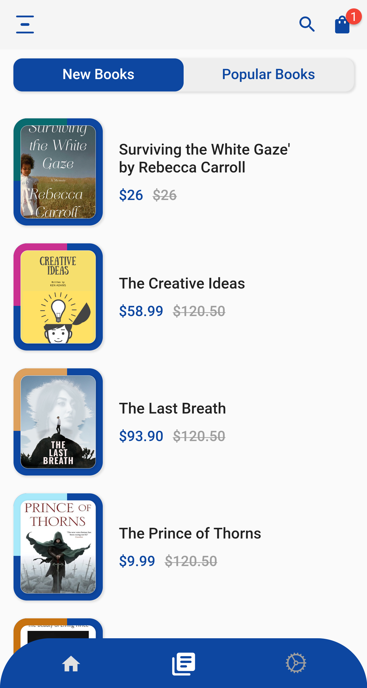
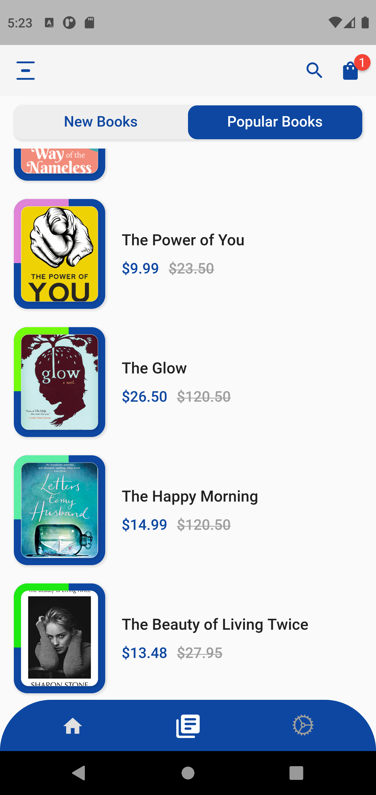
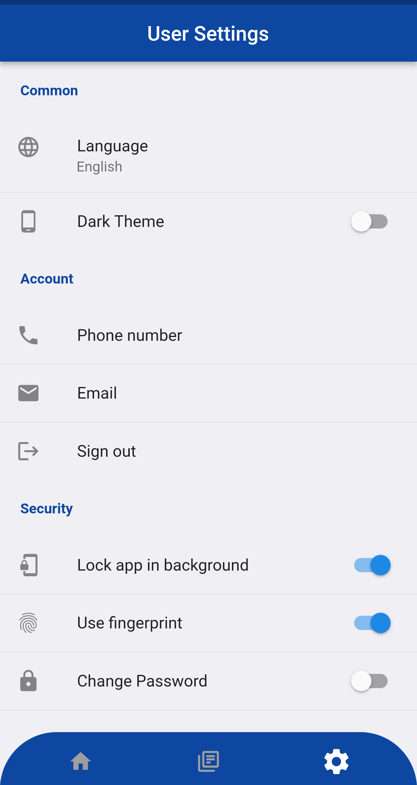

# flutter_online_book_store

On our E-commerce app #UI has three pages one for the Home page which has a horizontal list of categories then a list of our products. Second Page has a tab view which shows the Latest and Popular books. Final page has the user setting view.

## [Watch it on YouTube](https://www.youtube.com/watch?v=yXmQKBA5ppE&list=PL6vcAuTKAaYdRkc_jt08x23plwGAYiGTU)

**Packages we are using:**

- flutter_svg: [link](https://pub.dev/packages/flutter_svg)

## Screens it contains:

=> Home Screen

=> Books Screen

=> User Settings Screen

Now it contains all the screen, thanks for your love and support 🙏 

## Photos

